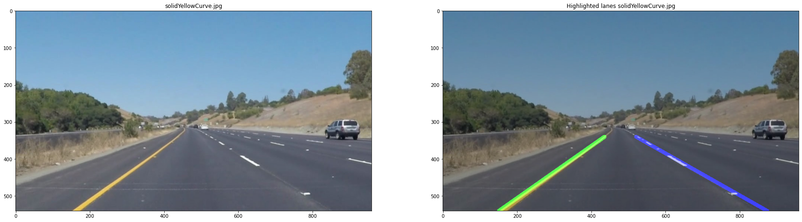

# **Finding Lane Lines on the Road** 

## Writeup

### Detection results

The results of image processing can be found in "test_images_output" directory. For the results of video processing see content of "test_videos_output" directory.

### Reflection

### 1. Description of the pipeline

Before implementing the pipeline I have extended the helper functions to make the code structure better readable and have handy methods for plotting available.

#### Helper functions

So in the section "Helper functions" I have added const variables, line the edges of the mask and following functions:

* *load_images()*: loading all images from the file at once.

* *print_images()*: plot original image next to the manipulated. Final output looks like this:

    

* *get_vertices()*: to nicely retrieve a polygon for a mask

#### Lane Finding Pipeline

The actual pipeline is defined in am method *process_frame()* in the section "Build a Lane Finding Pipeline". For images it is triggered in the same jupyter cell.

The pipeline consists of following steps:

1. Generate grayscaled images from the origin image: *grayscale()*
2. Apply Gaussian smoothing the grayscaled image in order to eliminate noise: *gaussian_blur()*
3. Apply Canny algorithm for edge detection onto gaussian-smoothed grayscale image: *canny()*
4. Define region of interest (ROI) / mask: *region_of_interest()*
5. Apply Hough transform onto the masked image: *hough_lines()* This calls *draw_lines()* function, which is described in next subsection.
6. Draw the lines, which indicate detected lanes, onto the original image: *weighted_img()*

#### Modified *draw_lines()* function

Among multiple approaches I've tried, following showed best results and good performance.

1. Iterate over all lines and define, whether a line belongs to the left or to the right lane. This distinction is made based on the sign of the slope, negative - right lane, positive - left lane.
2. For left and right lanes respectively, find the longest line.
3. Calculate slope and shift for the longest line on the left/right lane.
4. Filter out false negatives: check, whether the slope is valid (0,001< slope < - 0,001).
5. Extrapolate the longest lines to match the whole lanes. For this I take the two points (top & bottom) an the y-axis as a limit on the image and calculate corresponding values on the x-axis.
6. Draw lines on top of lanes. Green is used for the left name and blue for the right lane.

### 2. Potential shortcomings with your current pipeline

This solution is not perfect. For instance, it doesn't work "challenge.mp4". Here it is necessary to adjust the mask (Region of Interest) ranges due to different position of the camera on the vehicle and curvature of the lane. Some of the shortcomings:

* [S1]: There is no cache for the previously detected lines on the lane. This would help to smooth lane detection and overcome places, where no sufficiently long line has been detected (normally lane doesn't disappear)
* [S2]: The performance of the algorithtm will drop if there's a vehicle ahead, hiding the lanes.
* [S3]: The performace will drop on curvatures.
* [S4]: Extrapolated line doesn't always perfectly match the lane, so the extrapolated lines do not meet in the middle of the lane on the horizon.
* [S5]: Neither lane color nor type is detected.

### 3. Possible improvements to your pipeline

NB: Improvements are matched to the shortcomings from the previous section.

* [I1]: Add cache of previously detected lines, containing points, slope and shift. This will help to eliminate false negative detections as well as smooth lane detection in the next frame.
* [I2]:  Lines cache should help here + decrease of the mask in the longitudional direction.
* [I3]: Adjust the mask (region of interest) depending on the steering wheel angle and the quality of detected lanes (if they become to short in the given matching with the original mask)
* [I4]:  Make a polyline out of a line between two points
* [I5]: Detect lane color (intensity in RGB inage) and lane type (dashed vs. solid). This should also minimize false positives by detecting barriers and not lanes.